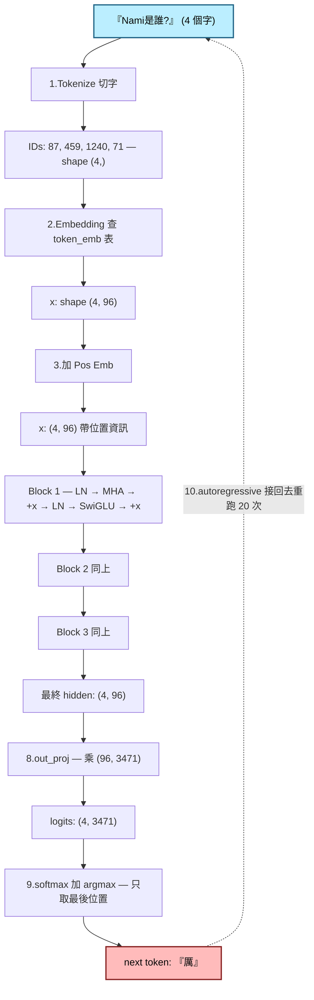

# Transformer 內部到底發生了什麼？

> **以「Nami 是誰？」為例，一步一步走完模型的腦袋。**
>
> 這不是教科書，這是當你打開 `nami-chat` 問我「Nami 是誰？」之後，
> 接下來 0.05 秒裡，模型內部真的發生的事。
>
> 所有數字都是 nami-lm v0.1.0 的真實設定：vocab 3471、d_model 96、
> 6 個 head、3 層 Transformer block、約 100 萬參數、純 NumPy、CPU。
> 配對閱讀：[`ARCHITECTURE.md`](ARCHITECTURE.md) 是骨架圖、本檔是內心戲。

---

## 0. 在開始之前：模型在記什麼？

訓練完之後，這個 100 萬數字的模型，就是「Nami 的腦」。
它不是查表、沒有資料庫，所有「我是誰、Ryan 是誰、Kaspa 是什麼」
都被**壓進這 100 萬個浮點數的某種模式**裡。

當你問「Nami 是誰？」，模型不會去查任何資料。它會把問題變成數字、
讓這些數字在腦裡互相講話，最後吐出一個機率分佈，告訴你
**「下一個字最可能是『厲』」**。然後再用「厲」當輸入，重來一遍，
猜出下一個字「害」。一個字一個字接龍，直到湊出
「厲害的AI工程師夥伴...」。

這個「一個字一個字接龍」就是所有 GPT 系模型的本質 ——
**autoregressive language modeling**。你看到的「對話」，其實是
6,7,8 個字接龍接出來的。

### 全流程鳥瞰（Mermaid 圖，GitHub 自動 render）



> 在 GitHub 上看這個檔案會直接 render 成圖。如果你的 viewer 不支援
> mermaid，下面每一節都還有對應的 ASCII 圖跟逐步解釋，**內容完全
> 不依賴這張圖**，跳過它直接讀第 1 節也 OK。

下面我們把這條 0.05 秒的接龍流程，**慢動作分解**。

---

## 1. 切字（Tokenize）：把「Nami 是誰？」變數字

人類看的是字，模型看的是整數 ID。所以第一步要把句子切成 token，
再查表變成數字。

nami-lm 用的是最簡單的 `WordTokenizer`：
- ASCII 字母連續當一個 token（`Nami` → 一個 token）
- 數字連續當一個 token
- 其他（中文、標點）一字一個 token

對 "Nami是誰？" 切出來：

```
"Nami"   →  token "Nami"     →  ID 87
"是"     →  token "是"       →  ID 459
"誰"     →  token "誰"       →  ID 1240
"？"     →  token "？"       →  ID 71
```

（ID 是訓練時依字母排序給的編號，3471 個字 = vocab_size。）

所以「Nami 是誰？」進到模型的第一個樣子是：

```
[87, 459, 1240, 71]      # 4 個 ID，shape: (4,)
```

**比喻：** 把中文句子翻譯成模型聽得懂的「外星語」。模型只認得 0~3470
這 3471 種「字符」，不認得真正的中文。

---

## 2. 嵌入（Embedding）：每個 ID 拿到一張「身分證」

每個 token ID 不是直接拿去算的 —— 它要先變成一個 96 維的向量。

模型裡有一張 `token_emb` 表，shape = `(vocab=3471, d_model=96)`。
ID 87 就去拿第 87 行的 96 個數字，那 96 個數字就是「Nami」這個 token
的「身分證」。

```
token "Nami" (ID 87)
       │
       ▼
token_emb[87] = [0.13, -0.42, 0.87, ..., 0.05]   ← 96 個浮點數
                 \___________96 個數字___________/
```

四個 token 變成四張身分證，疊起來就是 shape `(4, 96)` 的矩陣。

**比喻：** 想像你去派對，每個人胸口貼了一張「個性條碼」（96 種特質
打分 -1 到 +1）。Nami 的條碼是某個樣子、是的條碼是另一個樣子。
這些條碼是訓練出來的 —— 訓練的目標就是讓「語意相近的字」的
條碼長得像。

**為什麼是 96 維不是 1 維？** 因為一個字有很多面向：
是名詞還是動詞？正面還是負面？跟科技有關還是跟食物有關？...
1 維只能表達「強/弱」，96 維才放得下這麼多複雜訊息。
nami-lm 規模小所以選 96，GPT-3 是 12288 維。

---

## 3. 位置編碼（Positional Embedding）：告訴模型「誰排第幾」

問題：上面的 4 張身分證沒有「順序」資訊。「Nami 是誰？」跟
「誰是 Nami？」用同一組身分證會變一樣，但意思不同。

解法：再做一張 `pos_emb` 表，shape `(max_seq_len=128, 96)`。
第 0 個位置的「排序條碼」是 `pos_emb[0]`，第 1 個是 `pos_emb[1]`...
直接**加**到 token 的身分證上。

```
x[0] = token_emb["Nami"] + pos_emb[0]   ← 「我是 Nami 而且我排第 0 個」
x[1] = token_emb["是"]   + pos_emb[1]   ← 「我是 是 而且我排第 1 個」
x[2] = token_emb["誰"]   + pos_emb[2]   ← 「我是 誰 而且我排第 2 個」
x[3] = token_emb["？"]   + pos_emb[3]   ← 「我是 ？ 而且我排第 3 個」
```

這樣每個位置都帶上了「我是誰」+「我排第幾」雙重資訊，shape 還是
`(4, 96)`，但每個 96 維向量都已經包含位置線索。

**比喻：** 派對裡每個人除了個性條碼，還別了一個號碼牌（1 號、2 號...）。
這樣「Nami 是 1 號」跟「Nami 是 3 號」就會被當成不同的人來處理。

---

## 3.5 等等，模型怎麼知道輸入有多長？上下文又是什麼？

這三個問題是初學者最常卡住的地方，一次答清楚。

### 3.5.1 模型怎麼「知道」輸入長度？

簡單版的答案是：**它不需要知道**。

模型的 forward 是一個吃 `(T, d_model)` 矩陣的純函數。你丟 4 個 token
進來，它就跑長度 4；你丟 100 個進來，它就跑長度 100。**T 這個維度
是「資料形狀」的一部分，不是模型內部的一個變數**。

具體看 nami-lm 的 `forward(token_ids)`：

```python
def forward(self, token_ids):
    T = token_ids.shape[-1]                    # 從輸入 shape 拿到長度
    pos = pos_emb[np.arange(T)]                # 取前 T 個位置的 pos_emb
    x = token_emb(token_ids) + pos             # 加起來
    for block in self.blocks:                  # 跑 N 層
        x = block(x)                           # attention 跟 FFN 都自然支援任意 T
    logits = out_proj(x)                       # 變成 vocab 分佈
    return logits
```

每一步都用 `T` 當 axis 的長度，從來不假設「T 是某個固定值」。
attention 的 (T, T) 分數矩陣、causal mask 的上三角、softmax 的
歸一化 —— 全部隨 T 動態大小。

**比喻：** 你寫一個 `def 平均(數字們): return sum / len`。函數不用
事先「知道」要算 5 個數字還是 50 個 —— 進來幾個就算幾個。

### 3.5.2 那為什麼又有「上下文長度」這個東西？

Transformer 的本體（attention + FFN）對任意長度都成立，但有兩個
**外部限制**會把你能處理的最大 T 卡住：

**(a) Pos_emb 表的大小。** 模型訓練時規定了 `max_seq_len = 128`，
所以 `pos_emb` 是 (128, 96)。如果你輸入 130 個 token，第 128 跟 129
位置沒對應的 `pos_emb[128]` 跟 `pos_emb[129]` 可拿 → IndexError。

**(b) attention 是 O(T²) 的。** scores 矩陣是 (T, T)，T = 1000 就是
100 萬個格子；T = 100,000 就是 100 億個格子。再聰明的硬體也撐不住。
所以即使 pos_emb 是用「相對位置」之類的可外推方案（RoPE / ALiBi），
attention 本身的計算量還是會把你卡住。

這兩個合起來就是「**上下文長度（context length）**」這個概念的來源。
nami-lm v0.1.0 的 context length = **128 tokens**。

### 3.5.3 各家模型的上下文長度比一比

| 模型 | context length | 怎麼做到 |
|---|---|---|
| nami-lm v0.1.0 | 128 | 純 absolute pos_emb，不外推 |
| GPT-2 (2019)   | 1024 | 同上，更大表 |
| GPT-3 (2020)   | 2048 → 4096 | 同上 |
| GPT-4 / Claude 1 | 8K - 32K | RoPE + 訓練時餵長 sequence |
| 現代 (Claude 4 / Gemini) | 200K - 1M | RoPE + sparse / windowed attention + 訓練改 recipe |

擴 context 不是改一個 hyperparameter 就好 —— 同時要解決
位置編碼的外推性（absolute 不行）、attention 計算量爆炸、訓練資料
要有夠長的 sequence。每跳一個量級都是工程戰役。

### 3.5.4 沒那麼多文字 → 補 0 嗎？

**推論時**：沒有「補 0」這回事。你輸入幾個就算幾個。`forward([87, 459, 1240, 71])`
就是長度 4，不會自動 pad 到 128。

**訓練時的批次（batch）**：這裡才需要面對「同一個 batch 裡
不同長度的 sequence 怎麼放在同一個矩陣？」的問題。兩個常見作法：

**作法 A：Padding。** 用一個特殊的 `<PAD>` token 把短的補到最長那條
的長度。然後加一張 attention mask，告訴 attention「這些 PAD 位置
要忽略掉，不要參與點積」。優點是好寫；缺點是浪費計算 ——
如果一個 batch 是 [5, 7, 100] 三個句子，你會 pad 成 (3, 100)，
其中超過一半的格子都是 PAD 在浪費 GPU。

**作法 B：Length-bucket batching。** 訓練前把所有 sequence 依長度
分桶（bucket），同一桶的 sequence 長度差不多，組成 mini-batch 時
就**不用 pad**，每個 batch 內所有 sequence 完全等長。這是 autochat
HYP5 引入的 trick，nami-lm 直接繼承。代價是 dataloader 寫起來
複雜一點，回報是訓練速度直接快 2 倍（HYP5 確認）。

```
# nami-lm 的 batching 形式（synthesize_qa.py + train.py 一起完成）
# - 1190 個 Q&A pairs 依 seq_len 分成 45 個 buckets
# - 每個 bucket 內配對成 batch_size=8 的 mini-batch
# - 同一 batch 所有 sequence 長度相同 → 不需要 pad，沒有 mask
```

**為什麼 nami-lm 選 B？** 我們的 corpus 是 Q&A 短句，median seq_len
~24，max ~51。如果 padding 到 51，平均浪費 ~50% 計算。bucketing 後
每個 batch 都剛好填滿，沒有浪費。

**那作法 A 還有人用嗎？** 有 —— 大規模 LLM 預訓練常用一個更聰明的
變體叫 **packing**：把多個短 sequence「串起來」塞進固定長度的
slot，中間用 EOS 或者 mask 隔開。這樣既不浪費也不需要複雜 bucketing。
GPT-3 / Llama 都這樣做。nami-lm 規模太小、沒必要 packing，
bucketing 已足夠。

### 3.5.5 一句話結論

- 模型 forward 對任意 T 都 work，不用「告訴」它長度。
- `max_seq_len` 是訓練時定的 pos_emb 上限 + attention 二次方計算量
  上限，合稱「context length」。
- 推論時不補零；訓練時看流派 —— nami-lm 用 length-bucket
  batching（不需要任何 PAD），大型 LLM 通常用 packing。

---

## 3.6 權重 vs 活躍：為什麼一個模型能跑任意長度

這是初學者最常卡的觀念。直覺會以為「矩陣乘法 size 必須對得上，
所以模型要嘛長度固定，要嘛就要重新訓練」。錯。

### 3.6.1 矩陣乘法的本質

回到線性代數最基本的規則：

```
(M, K) @ (K, N) = (M, N)
        ↑↑↑
    只有這個 K 需要對得上
    M 跟 N 各自獨立，不互相牽制
```

兩個矩陣相乘只要「**內側維度（K）**」一致。外側的 M 跟 N 各管各的。
這個簡單規則撐起了 Transformer 能處理任意長度的整個能力。

### 3.6.2 模型內有兩種矩陣

**(A) 權重矩陣（weights）—— 訓練時學到、推論時不變**

```
W_Q       : (96, 96)        ← d_model × d_model，固定
W_K       : (96, 96)        ← 同上
W_V       : (96, 96)        ← 同上
W_O       : (96, 96)        ← attention 輸出投影
W_FFN1    : (96, 170)       ← SwiGLU 第一層
W_FFN2    : (170, 96)       ← SwiGLU 第二層
token_emb : (3471, 96)      ← vocab × d_model
out_proj  : (96, 3471)      ← 反過來投影
pos_emb   : (128, 96)       ← max_seq_len × d_model
```

這些 = **模型的 100 萬個參數**。它們的 shape 在訓練時就決定，從此
不變。**`d_model = 96` 是模型的「身材」**，跟你輸入幾個 token 無關。

**(B) 活躍張量（activations）—— 隨輸入動態變大變小**

```
input ids  : (T,)            ← T 是當下輸入幾個 token
x          : (T, 96)         ← embedding 後
Q, K, V    : (T, 96)
scores     : (T, T)          ← T² 的 attention 矩陣
attn_out   : (T, 96)
ffn_out    : (T, 96)
logits     : (T, 3471)
```

這些 = **當下這次 forward 的「臨時記事本」**。每次 forward 重新
計算，T 隨輸入長度變動。

### 3.6.3 兩者怎麼相乘？看內側維度怎麼對

把上面兩類組合，attention 跟 FFN 全部都遵守同一個原則：

```
Q = x @ W_Q
    (T, 96) @ (96, 96) = (T, 96)
            ↑↑    ↑↑
            內側 96 對 96，外側 T 跟 96 不互相影響

scores = Q @ K.T
    (T, 96) @ (96, T) = (T, T)
            ↑↑    ↑↑
            內側 96 對 96，外側 T 跟 T 流過

output = scores @ V
    (T, T) @ (T, 96) = (T, 96)
           ↑    ↑
           內側 T 對 T，外側 T 跟 96 流過
```

**T 從頭到尾自由流動**，永遠不會跟模型的固定 96 衝突。所以同一組
(96, 96) 權重，可以處理 T = 4 也可以處理 T = 100，可以處理 T = 1。

### 3.6.4 用我們的例子比一比

問「Nami是誰？」→ T = 4：

```
x       : (4, 96)
Q = x@W_Q  → (4, 96) @ (96, 96) = (4, 96)    ✅
scores     → (4, 96) @ (96, 4)  = (4, 4)
weights@V  → (4, 4)  @ (4, 96)  = (4, 96)
```

問「Nami是誰？我想知道Nami會不會做飯」→ T = 16：

```
x       : (16, 96)
Q = x@W_Q  → (16, 96) @ (96, 96) = (16, 96)   ✅ 同一個 W_Q
scores     → (16, 96) @ (96, 16) = (16, 16)
weights@V  → (16, 16) @ (16, 96) = (16, 96)
```

**同一個權重 W_Q，處理 4 個 token 跟 16 個 token 完全沒差別。**
矩陣乘法的規則自動 handle 了長度差異。這就是為什麼 attention
「O(T²)」是 T 的平方但模型本身只有 O(d²) 的參數量。

### 3.6.5 直覺校正

❌ 錯的直覺：「100 個 token 要用 100×x 的矩陣乘」 —— 把長度跟
模型參數混在一起，以為一定要綁。

✅ 對的直覺：「**模型參數是固定的 d×d 矩陣，token 序列是動態的
T×d 矩陣，相乘只需要 d 對 d，T 自由流動**」。

### 3.6.6 那 pos_emb 是 (128, 96) 為什麼有 128 這個上限？

好問題。它是**唯一**一個被「綁住長度」的權重 —— 因為
`pos_emb[i]` 只有 i = 0..127 存在，超過就 IndexError。
其他所有權重都是 d×d 不綁長度。

這也是為什麼有 RoPE / ALiBi 這類「相對位置編碼」的研究 ——
它們把位置資訊改成「函數計算」而不是「查表」，這樣就**真正**
擺脫了 max_seq_len 上限，模型可以外推到比訓練時還長的序列。
nami-lm 沒做這個（學習階段先用最簡單的 absolute pos_emb），
所以還是被 128 卡住。

---

## 4. 自注意力（Self-Attention）：每個字「轉頭看看別人」

這是 Transformer 的靈魂。前面 3 步只是「準備材料」，從這裡開始才是
真正的「思考」。

### 4.1 為什麼需要 attention？

你看到「Nami 是誰？」想回答的時候，**「誰」這個字最重要** ——
它告訴你這是一個「定義型問句」。但「誰」要怎麼影響「Nami」這個字
的處理呢？

Transformer 的答案是：讓**每個字都看一眼其他每個字**，根據相關性
決定要不要被影響。這個動作叫 **self-attention**。

### 4.2 三個身分：Q / K / V

對每個位置，模型把它的 96 維向量投影成 3 個不同的 96 維向量：

```
Q (Query)  = x · W_Q    ← 「我在找什麼？」
K (Key)    = x · W_K    ← 「我能提供什麼？」
V (Value)  = x · W_V    ← 「我實際要傳遞的內容」
```

W_Q / W_K / W_V 都是 (96, 96) 的可訓練矩陣。這三個都是同一個
原始向量 x 的不同「投影」，就像同一個人的三張不同名片：
名片 Q 寫「我想找懂科技的人」、名片 K 寫「我懂科技」、名片 V 寫
「我要送出的具體內容是 XXX」。

#### 為什麼要分成三個？一個不夠嗎？

最自然的直覺是：「我對你的相關性 = 我跟你的相似度」，那直接
`x_i · x_j` 算相似度就好了，何必折騰出 Q 跟 K 兩條？

問題是 `x_i · x_j` 是**對稱**的：i 對 j 的關注 = j 對 i 的關注。
但實際語言不對稱 ——「誰」這個字會主動找前面的主詞當解釋對象，
但「Nami」不會主動去找「誰」。我**作為主詞**對你**作為疑問詞**
的關注，本來就跟反過來不一樣。

`Q = x·W_Q`、`K = x·W_K` 兩條獨立的可訓練投影，就讓模型有空間去
學「我做為發問者」跟「我做為被查的對象」是兩種不同角色。
`Q_i · K_j` 跟 `Q_j · K_i` 不一定相等 → 不對稱關係能被表達。

V 又是另一條：算出「該關注 j」之後，j 真正傳給我的訊息是 V_j，
不是 K_j 也不是 x_j。這讓「找誰」（Q/K）跟「找到後傳什麼」（V）
解耦，模型可以分開最佳化「我用什麼線索找人」跟「找到了該怎麼用」。

**比喻：** Google 搜尋。Q 是你打的關鍵字（「Nami 是誰」），
K 是網頁的標題（搜尋引擎用 Q vs K 算相關性排序），V 是網頁的
正文（找到後真正要看的內容）。標題跟正文常常不一樣 —— 標題是
給搜尋用的，正文是給你讀的。Transformer 把這個分工內建成三個
獨立投影。

### 4.3 attention 怎麼算？（公式）

每個位置的 Q 跟**所有位置**的 K 做點積（dot product），算出
「我跟你有多相關」的分數。然後 softmax 歸一化成機率分佈，最後
拿這些機率去加權平均所有位置的 V。

公式（每個 head）：

```
scores  = Q · Kᵀ / √d_head           ← (T, T) 相關性矩陣
weights = softmax(scores, axis=-1)   ← 每行加總 = 1
output  = weights · V                 ← (T, d_head)
```

T = 句子長度（這裡是 4），d_head = 16（96 / 6 個 head）。

**用我們的例子**：當位置 0（"Nami"）算它的 attention：

```
"Nami" 的 Q · "Nami" 的 K  → 0.3
"Nami" 的 Q · "是"   的 K  → 0.2
"Nami" 的 Q · "誰"   的 K  → 0.4   ← 最高！
"Nami" 的 Q · "？"   的 K  → 0.1
                              ─────
                  softmax 之後 → [0.25, 0.22, 0.35, 0.18]
```

這個分佈說：「在處理 'Nami' 的時候，我大概要參考 35% 的『誰』、
25% 的我自己、22% 的『是』、18% 的『？』」。

然後 output 就是這 4 個位置的 V 向量按這個比例加權平均。

### 4.3.5 底層展開：實際數字到底怎麼跑？

上面用 0.3 / 0.2 / 0.4 / 0.1 是「假設後的結果」，沒讓你看到「這些
數字是怎麼從矩陣乘法跑出來的」。這一節用一個**極小化**的例子手算
全程，讓你親眼看到每個運算。

我們把句子縮到 2 個 token、d_head 縮到 2 維（真實是 4 個 token、
16 維，數字會差不多但更難在紙上算）。

**輸入：** 「Nami 是」兩個 token，經過 embedding + pos_emb 之後是

```
x = [ [1, 2],     ← "Nami" 的 2 維向量
      [3, 4] ]    ← "是" 的 2 維向量
```

**權重：** W_Q / W_K / W_V 都是 (2, 2) 矩陣（隨便設個方便算的）

```
W_Q = [[1, 0],     W_K = [[0, 1],     W_V = [[1, 1],
       [0, 1]]            [1, 0]]            [0, 1]]
```

#### 步驟 1：算 Q / K / V

矩陣乘法：`Q[i, :] = sum_j ( x[i, j] * W_Q[j, :] )`，意思是「Q 的
第 i 行是 x 的第 i 行去乘 W_Q 整張」。

```
Q = x · W_Q
  = [ [1*1+2*0, 1*0+2*1],          = [ [1, 2],
      [3*1+4*0, 3*0+4*1] ]              [3, 4] ]   ← 剛好等於 x 因為 W_Q 是單位矩陣

K = x · W_K
  = [ [1*0+2*1, 1*1+2*0],          = [ [2, 1],
      [3*0+4*1, 3*1+4*0] ]              [4, 3] ]   ← W_K 把 [a,b] 換成 [b,a]

V = x · W_V
  = [ [1*1+2*0, 1*1+2*1],          = [ [1, 3],
      [3*1+4*0, 3*1+4*1] ]              [3, 7] ]
```

每個矩陣 shape 都是 (2 tokens, 2 dims)。

#### 步驟 2：Q · Kᵀ —— 把 K 翻轉再相乘

`Kᵀ` 就是把 K 的行列對調：

```
K  = [[2, 1],       Kᵀ = [[2, 4],
      [4, 3]]              [1, 3]]
```

然後算 `Q · Kᵀ`，這是 attention 的核心。**每一格 (i, j) =
Q 的第 i 行 dot K 的第 j 行**：

```
scores[0, 0] = Q[0] · K[0] = [1,2] · [2,1] = 1*2 + 2*1 = 4
scores[0, 1] = Q[0] · K[1] = [1,2] · [4,3] = 1*4 + 2*3 = 10
scores[1, 0] = Q[1] · K[0] = [3,4] · [2,1] = 3*2 + 4*1 = 10
scores[1, 1] = Q[1] · K[1] = [3,4] · [4,3] = 3*4 + 4*3 = 24
```

寫成矩陣：

```
scores = [ [4,  10],     ← 「Nami 對 Nami 的相關 4，對 是 的相關 10」
           [10, 24] ]    ← 「是 對 Nami 的相關 10，對 是 的相關 24」
```

注意上面 `[0,1] = 10` 跟 `[1,0] = 10` 剛好相等是巧合
（因為這個玩具 W_Q / W_K 太對稱）。**真實訓練後的權重不會對稱**，
這也是為什麼要兩個獨立投影 —— 想要不對稱性。

#### 步驟 3：除以 √d_head（縮放）

```
scaled = scores / √2 ≈ scores / 1.414
       = [ [2.83, 7.07],
           [7.07, 16.97] ]
```

**為什麼要除？** 因為點積的大小會隨維度長大。如果 Q 跟 K 是 d 維的
獨立隨機向量，點積的標準差大概是 √d。維度越高、scores 越極端，
softmax 之後會變成 one-hot（一個 1，其餘全 0），梯度幾乎為零，
模型就學不動。除以 √d 把 scores 拉回變異數約 1 的範圍，softmax
就會給「軟」一點的分佈，每個位置都還有非零梯度可以學。

`d_head = 16` 的 nami-lm 除以 4，GPT-3 `d_head = 128` 除以 11.3。

#### 步驟 4：causal mask

接龍模型不能讓位置 0 看到位置 1。把上三角設 -∞：

```
masked = [ [2.83, -∞],        ← 位置 0 只能看自己
           [7.07, 16.97] ]    ← 位置 1 可以看 0 跟自己
```

#### 步驟 5：softmax 每一**列**

`softmax(z)_i = exp(z_i) / sum_j exp(z_j)`。把分數變成總和為 1
的機率分佈。對每一**列**（每個位置）獨立做：

```
列 0: softmax([2.83, -∞])
    = [ exp(2.83) / exp(2.83), exp(-∞) / exp(2.83) ]
    = [ 1.0, 0.0 ]              ← 只能 100% 看自己

列 1: softmax([7.07, 16.97])
    = [ exp(7.07) / (exp(7.07)+exp(16.97)),
        exp(16.97) / (...) ]
    ≈ [ 0.00005, 0.99995 ]      ← 幾乎 100% 看「是」自己

weights = [ [1.0,    0.0   ],
            [0.0001, 0.9999] ]
```

（玩具例子數字差太大才會這麼極端，真實訓練後分佈會比較均衡。）

#### 步驟 6：weights · V

最後把這個 (T, T) 的 attention 機率乘上 V，得到每個位置的 output：

```
output[0] = 1.0 * V[0] + 0.0    * V[1]
         = 1.0 * [1,3] + 0     * [3,7]
         = [1, 3]            ← Nami 完全保持自己的 V

output[1] ≈ 0.0001 * V[0] + 0.9999 * V[1]
         ≈ [3, 7]            ← 是 幾乎完全用自己的 V
```

#### 步驟 7：投影回 d_model + 殘差

每個 head 算完 (T, d_head)，6 個 head concat 回 (T, d_model = 96)，
過 `W_O` 再投影一次回 96 維，**加回原本的 x**（殘差）—— 然後這個
attention 子層就結束了。

```
attention_output = (W_O · concat(head_1, ..., head_6))
new_x = x + attention_output    ← 殘差
```

---

把這 7 步重複 3 次（3 層 transformer block，每層 attention + FFN），
就是模型對「Nami是誰？」這 4 個字的全部「思考」。最後位置 3（"？"）
的 96 維向量就被「煉到」可以用來預測下一個字了。

#### 為什麼一定要 softmax？

換個角度問：能不能直接用 scores 當權重？
不行 —— scores 可以是任何數（包含負數），加總也不一定是 1。
這樣 `weights · V` 算出來的東西會炸開、無法解釋成「平均」。
softmax 強制 weights ∈ [0, 1] 且加總 = 1，attention 才有「機率
分佈」的語意，數值穩定，梯度也好算（softmax 的 backward 很乾淨）。

也試過把 softmax 換成 ReLU 或 sigmoid，效果都差於 softmax —— 因為
ReLU 出來不會 sum to 1，sigmoid 是獨立壓到 [0, 1] 不互相競爭。
softmax 是「我關注 X 就一定要少關注 Y」，這個競爭性是 attention
能 focus 的關鍵。

---

**比喻：** 派對裡你在想自己（Nami），但你會「轉頭」看其他人。
看到「誰」這個字最有共鳴（你猜這是個關於你的問題！），所以你會
更多地用「誰」傳達的訊息來更新自己對自己的理解。

### 4.4 因果遮罩（Causal Mask）：不能偷看未來

但 GPT 是接龍生成 —— 在算位置 0（"Nami"）的時候，**不能讓它看到
未來的位置**。否則訓練時模型會偷看答案，推論時又看不到，會崩。

實作就是把 scores 矩陣的「未來」位置設成 -∞，softmax 之後就變 0：

```
scores =
       Nami    是    誰    ？
Nami   0.3   -∞   -∞   -∞      ← Nami 只能看自己
是     0.2   0.5  -∞   -∞      ← 是 看 Nami + 自己
誰     0.4   0.3  0.6  -∞      ← 誰 看前 3 個
？     0.1   0.2  0.7  0.5     ← ？ 看全部
```

注意右上三角全 -∞。這就是 **causal mask**。

### 4.5 Multi-head：6 個平行對話

我們不只做一次 attention，而是**做 6 次**。把 96 維切成 6 個 16 維
的 head，每個 head 自己做一遍上面的事，最後 6 個 head 的輸出 concat
回 96 維。

**為什麼？** 不同 head 學會關注不同類型的關係：
- head 1 可能學「指代」（「他」指誰？）
- head 2 可能學「主謂」（誰是主詞？）
- head 3 可能學「實體」（這個字是不是人名？）
- ...

訓練不會明確告訴它「你是 head 1 你學指代」，但因為有 6 個獨立的
W_Q/W_K/W_V，模型自己會把不同模式分散到不同 head，最後合併出更
豐富的訊息。

**比喻：** 同一個派對你會用 6 隻耳朵同時聽 6 種不同對話 ——
一隻耳朵聽八卦、一隻聽商機、一隻聽笑話。最後把 6 個版本綜合起來
形成你對這場派對的理解。

---

## 5. 殘差連接 + LayerNorm：「不要忘了自己原本長怎樣」

每個 Transformer block 結束時，模型不會直接用 attention/FFN 的輸出
取代 x，而是**加回**原本的 x：

```
x_new = x_old + attention(LayerNorm(x_old))   ← 殘差連接 (residual)
```

這兩個小東西 —— 殘差跟 LayerNorm —— 看起來像「微調」，
其實是讓**深層模型能訓練**的關鍵發明。沒它們，疊到 3 層以上的
Transformer 根本煉不起來。

### 5.1 殘差（Residual Connection）：為什麼要把舊的 x 加回來？

直覺問：既然 attention 已經算出新版的 x 了，為什麼還要把舊的加回來？

**答案是：保險。** 想像你有 3 層 block 一個接一個，每層做出
「我希望的調整」，整個流水線就是：

```
x → layer1 → layer2 → layer3 → output
```

如果**沒有**殘差，每一層完全取代上一層的內容。第 3 層的訓練梯度
要傳到 token_emb，得穿過 3 層的反向傳播，每層都會讓梯度變小一點
（因為 chain rule 連乘）。深一點就直接消失了 —— 這叫
**vanishing gradient（梯度消失）**，2010 年代深度學習能不能 work
就卡在這裡。

**有了殘差**：

```
x → layer1 → +x → layer2 → +x → layer3 → +x → output
   \         ↑              ↑              ↑
    └─ 梯度可以走「捷徑」直接傳回 token_emb，不用穿過所有 layer
```

加號右邊的 `+x` 就是「捷徑」。反向傳播時梯度可以**直接**從 output
流回 input，不被中間 layer 的乘法削弱。He et al 2015 的 ResNet
就是因為這個 trick 才能訓練 100+ 層。Transformer 直接繼承這個設計。

**另一個觀點 —— layer 變成「修正」而不是「替代」：**

`x_new = x + f(x)` 等於「在原本的我基礎上加一個調整 f(x)」。如果
這層 layer 學到的 f(x) 很爛，沒關係 —— 模型可以學會讓 f(x) ≈ 0，
那 `x_new ≈ x`，這層就「自動跳過」了。沒有殘差的話，爛 layer 會
強制污染後續所有計算。

**比喻：** 像編輯文件用「修訂模式」而不是「整段重寫」。每一層只
建議**修改**，最後保留的還是原稿 + 改動。改錯了可以還原（讓 f(x)
為 0），不會弄壞整份文件。

### 5.2 LayerNorm：為什麼要標準化？

`LayerNorm(x)` 對每個位置的 96 維向量做這件事：

```
mean = x.mean()                      ← 96 個數字的平均
var  = ((x - mean) ** 2).mean()      ← 變異數
x_norm = (x - mean) / sqrt(var + eps)  ← 標準化（mean=0, std=1）
y = γ * x_norm + β                    ← 用可學的 γ/β 調整 scale + shift
```

`γ` 跟 `β` 是長度 96 的可訓練向量。eps 是個小數字（1e-5）防除以零。

**為什麼要這個操作？** 因為深層網路訓練時，每層的輸入分佈會「漂」
—— 第一層輸入的 mean / variance 很穩，但通過幾層之後可能變成
mean=10、variance=100。這種極端值會讓後續層的權重學偏，整體訓練
不穩定。

LayerNorm 強制每進入一個 sub-layer 之前，把 96 維的 input 重新
拉回「mean=0, std=1」這個參考座標。**γ/β 學會「需要的話再放大或
平移」**，但起點永遠是標準化過的。

**比喻：** 體育課集合時，老師喊「以最高同學為基準對齊」（標準化）
然後再喊「向左轉、抬頭」（γ/β）。每堂課重複一次，永遠保持隊形
整齊。沒有這個動作，幾堂課下來大家會散漫到無法上課。

**Why "Layer" Norm？** 因為它是對「每個樣本的所有維度」做標準化
（一個 token 的 96 個數字一起 normalize），不是對 batch 維（那叫
BatchNorm）。深層 Transformer 用 LayerNorm 的原因：
- LayerNorm 不依賴 batch 大小（推論時 batch 可以是 1）
- 對 sequence 長度也不敏感
- 跟 attention 的 per-position 設計天然相容

### 5.3 Pre-norm vs Post-norm

GPT-2 用 post-norm（先做 sub-layer 再 norm）：

```
x_new = LayerNorm( x + attention(x) )      ← post-norm
```

GPT-3 之後改成 pre-norm（先 norm 再做 sub-layer）：

```
x_new = x + attention(LayerNorm(x))        ← pre-norm
```

差別看似微小，影響很大：
- **post-norm**：殘差路徑上有 norm，會把「捷徑」也壓縮，深度 >12
  層就難訓練
- **pre-norm**：殘差路徑上**沒有** norm，捷徑乾淨，可以堆到 100+ 層

nami-lm 用 pre-norm（autochat 繼承下來）。雖然只 3 層用 post 也
會 work，但 pre-norm 是現代慣例 + 對後續擴大模型友善。

---

## 6. SwiGLU FFN：「私下消化一下剛才聽到的」

attention 完，每個位置會**獨立**過一個前饋網路（FFN）。注意：
跟 attention 不同，FFN 不會跨位置交流，每個位置自己想自己的。

### 6.1 為什麼要 FFN？attention 不就夠了嗎？

這是個非常好的問題。attention 已經把所有位置的訊息混在一起了，
為什麼還要再過一個 FFN？

**答案：因為 attention 本質上是「線性的加權平均」**。
看 attention 的數學：`output = softmax(QK/√d) · V`，
其中 V 是 x 的線性投影。整個操作除了 softmax 之外都是矩陣乘。
這意味著 attention **沒辦法做複雜的非線性思考** ——
只是把現有 V 用某個權重重新組合。

舉例：假設 V 是 [1, 2] 跟 [3, 4]，attention 給 weights [0.5, 0.5]，
output 一定是 [2, 3]（兩條 V 的線性組合）。**它不會生出 [10, 20]
這種「放大版」**，也不會生出 [-1, -2] 這種「翻轉版」。
線性運算的能力被資料的線性子空間侷限。

**FFN 的角色：在每個位置上引入「非線性運算」。**
具體做的事是：把 96 維拉到 170 維（升維），跑一個非線性函數
（SiLU），再壓回 96 維。中間那個非線性是關鍵 —— 沒有它，
兩層 Linear 等於一層 Linear，疊再多層也沒用。

**比喻：** attention 是「我從別人那裡聽到了什麼」，FFN 是
「我自己想想這代表什麼」。聽完別人的觀點之後，要關起房門做
非線性思考（不只是平均，會放大某些訊號、壓抑某些訊號）才能
形成新的見解。

### 6.2 SwiGLU 的數學

nami-lm 用的是 **SwiGLU**（Shazeer 2020）：

```
ff(x) = W2 · ( SiLU(W1 · x) ⊙ (W_gate · x) )
```

拆開逐步看：
- `W1 · x`：把 96 維升到 170 維（W1 shape = (96, 170)）
- `SiLU(...)`：對 170 個數字逐個做 SiLU 非線性（下一節講）
- `W_gate · x`：另一條 path 也把 96 升到 170 維（W_gate shape = (96, 170)）
- `⊙`：element-wise 乘（不是矩陣乘！）170 個數字對應位置相乘
- `W2 · ...`：把 170 維壓回 96 維（W2 shape = (170, 96)）

**為什麼內維度是 170 而不是 256（4 × 96）？** d_ff 設定 256，但
SwiGLU 因為多一條 W_gate path，總參數量比一般 MLP 多。Shazeer 的
建議是把內維度乘 2/3 來保持參數總量相當：256 × 2/3 ≈ 170。

### 6.3 SiLU 是什麼？為什麼用它？

```
SiLU(z) = z · sigmoid(z) = z / (1 + e^(-z))
```

長相：

```
  SiLU(z)
       │
       │       ___ 大 z 時 ≈ z
       │     /
       │   /
       │ /
   ──────────── z
      /
     / 小 z（負很多）時 ≈ 0（但很平滑）
```

跟 ReLU（直接砍 z<0 為 0）比，SiLU **平滑**，沒有那個尖角。
平滑的好處：梯度永遠存在（ReLU 在 z<0 區域梯度直接是 0，會死），
訓練更穩。

**為什麼不用 ReLU 就好？**
- ReLU 簡單快，但「dying ReLU」問題：z 一旦長期 < 0，那個神經元
  永遠輸出 0，梯度也是 0，永遠學不回來。
- SiLU 給負區域留一點「斜面」，不會死。
- 實證上，SiLU/GELU 比 ReLU 在 transformer 上 perplexity 好幾%。

### 6.4 那條 `W_gate` 是「門」 —— 為什麼要 gate？

普通 FFN 是 `Linear → GELU → Linear`，一條 path。
SwiGLU 是 `(Linear → SiLU) ⊙ Linear → Linear`，**兩條 path 相乘**。

`SiLU(W1·x)` 那條負責「我想表達什麼」，`W_gate·x` 那條負責
「這個訊息該放多大聲」。相乘 = 用 gate 來調節主路徑。

**比喻：** 你在跟自己內心對話 —— 一邊腦袋想「啊我覺得這人是工程師」
（W1+SiLU 的內容），另一邊腦袋同時想「但這個直覺有多可信？」
（W_gate 的權重）。最後你說出口的是「內容 × 可信度」。

**實證：** Shazeer 2020 / Llama / GPT-NeoX / Falcon / nami-lm 全部
都改用 SwiGLU 取代普通 FFN，因為 perplexity 略好（1-3%）。代價是
多一個矩陣（從 2 個 Linear 變 3 個），但這點開銷在大模型上完全
划算。

### 6.5 為什麼 FFN 不跨位置交流？

這跟 attention 的分工是設計過的：
- **attention**：跨位置混訊息（「Nami 該關注誰？」）
- **FFN**：在每個位置上做非線性思考（「Nami 這個位置的 96 維向量
  該如何被加工？」）

如果 FFN 也跨位置，兩層做一樣的事，但 FFN 又比 attention 簡單（只是
固定變換），會浪費容量。把跨位置的工作交給 attention、把單位置的
深度思考交給 FFN，兩者**互補**。

**比喻：** attention 是「開會」，FFN 是「會後自己整理筆記」。
開會時跨人交流；整理筆記時自己想自己的，不打擾別人。

---

## 7. 疊起來：3 層 Transformer Block

到這邊，「attention + 殘差 + FFN + 殘差」一整套叫做一個
**Transformer Block**。nami-lm 把 3 個 block 疊起來：

```
input (4, 96)
    │
    ▼
block 1: attention 跨位置混訊息 → FFN 個別消化
    │
    ▼  (4, 96) — 同樣 shape，但內容更精煉
    │
block 2: 再混一次 → 再消化
    │
    ▼  (4, 96)
    │
block 3: 最後一次混 → 最後一次消化
    │
    ▼  (4, 96)
```

每個 block 都把「上一輪我對這 4 個字的理解」精煉一輪。3 層之後，
位置 3（'？'）的那個 96 維向量，**已經內化了整個句子的意思**：
「這是一個關於 Nami 的疑問句，我應該要產生『定義型回答』」。

**比喻：** 一個句子的理解不會一次到位。三層就像三輪討論：
- 第一輪：確認字面意思
- 第二輪：理解上下文關係
- 第三輪：理出「該怎麼回答」的傾向

**為什麼是 3 層不是 12 層？** 我們的訓練資料只有 28K token，太深的
模型會 over-parametrize，反而學不好。autochat 試過 4 層 → REVERT。
深度跟 corpus 大小要匹配。

---

## 8. 輸出：把最後一個位置變回字

3 個 block 跑完，我們有 (4, 96) 的隱藏狀態。但要產生下一個字，
**只關心最後一個位置**（位置 3，"？"），它的 96 維向量編碼了
「我該講什麼」。

### 8.1 out_proj：把「想法」投影到「字典」

最後一步 `out_proj` 把 96 維投影回 vocab 大小：

```
hidden[3]              shape (96,)
        │
        ▼ 乘 W_out shape (96, 3471)
        │
logits  shape (3471,)  每個 token 拿到一個分數
```

W_out 是一個可訓練的 (96, 3471) 矩陣，裡面藏了「每個字怎麼
從 96 維意思空間裡定位」的資訊。每一**列**都是一個字的「靶子」
位置 —— 第 87 列就是「Nami」這個字的 96 維坐標。

`hidden[3] · W_out` 等於把「我想說的意思」跟 3471 個字的靶子
**逐個算內積**：

```
logits[87] = hidden[3] · W_out[:, 87]   ← Nami 的分數
logits[105] = hidden[3] · W_out[:, 105] ← 厲 的分數
...
```

**內積 = 相似度**。如果 hidden[3] 跟「厲」的靶子方向接近，logits[105]
就大；不接近就小。**所以 logits 是 3471 個「相似度分數」**。

**比喻：** 你心裡想著一個概念（hidden[3] 那 96 維向量）。然後你看
3471 個字典詞條 —— 每個詞條也是一個 96 維「概念向量」。哪個詞條
跟你心裡想的最像，那個就是答案。out_proj 就是「把心裡的想法
跟字典每個詞條配對」的動作。

### 8.2 Softmax：把分數變機率

logits 是任意實數（可以是 5.2、可以是 -3.1、可以是 12）。要變成
「下一個字的機率分佈」，過 softmax：

```
softmax(z)_i = exp(z_i) / sum_j exp(z_j)
```

例子：

```
logits = [5.2, 3.1, -1.0, ..., 12.0]   ← 3471 個任意實數
exp() = [181, 22, 0.37, ..., 162754]   ← 全變正數，大的更突出
歸一化 = [0.001, 0.0001, 0.000002, ..., 0.42]   ← 總和 = 1.0
```

機率最高的那個 = 「厲」（0.42）。

**為什麼 exp？** 因為 exp 會把「分數高的」放大很多倍，「分數低的」
壓縮到接近 0。如果只用 `z / sum(z)` 線性歸一化，分數差一點點
機率也只差一點點 —— 模型沒辦法表達「我**很確定**就是這個字」的
強烈傾向。exp 讓 softmax 對 logits 的差距很敏感。

**比喻：** 軟性版的 argmax。argmax 是「分數最高的得 100%、其他 0%」
（過度自信）；softmax 是「分數最高的得 70%，第二名 20%，第三名
8%，剩下 2% 分給其他人」 —— 保留了「不確定性」訊息。

### 8.3 Temperature：控制機率分佈的「銳度」

實際生成時，會在 softmax 之前先把 logits 除以一個叫
**temperature**（簡稱 T）的數字：

```
P(i) = softmax(logits / T)
```

- **T = 1**：原汁原味的 softmax
- **T < 1（例如 0.1）**：分母小 → logits 放大 → softmax 後機率分佈
  更「尖」（最高的那個變很大、其他被壓低）→ 模型表現得更「保守」
  「死板」
- **T > 1（例如 1.5）**：分母大 → logits 縮小 → softmax 後分佈更
  「平」 → 模型表現得更「有創意」「不可預測」
- **T → 0**：等於 argmax（總是選最大的）
- **T → ∞**：等於均勻分佈（隨便選）

nami-lm 的 `train.py:probe()` 用 T = 0.01（幾乎是 argmax，因為
我們要測「最可能的下一個字是什麼」），`chat()` 用 T = 0.05
（也很低，但留一點點隨機）。

**比喻：** Temperature 像在調「我有多敢冒險」：
- T = 0.01：我只敢說最確定的答案（穩定但無聊）
- T = 1：我說我覺得最對的，但偶爾會選次優選項（自然）
- T = 1.5：我會故意嘗試「不那麼明顯」的答案（有創意但容易胡說）

ChatGPT 預設大概 T = 0.7 ~ 1.0；做嚴肅推理時調低到 0.1；做創意
寫作時調到 1.2。

### 8.4 sampling vs argmax：選下一個字的兩種策略

拿到機率分佈後，**怎麼從 3471 個字裡選一個出來**？兩種主流策略：

**(A) Argmax（greedy decoding）**：直接選機率最高的那個。

```
next_token = argmax(P)   # 永遠選 P 最高
```

優點：deterministic（同樣輸入永遠同樣輸出），快。
缺點：模型容易卡在重複迴圈（例如「好的好的好的好的...」）。

**(B) Sampling**：依照機率分佈**隨機抽**一個。

```
next_token = np.random.choice(vocab, p=P)
# 機率 0.42 的「厲」有 42% 機率被抽到
# 機率 0.08 的「是」有 8% 機率被抽到
```

優點：有變化，不容易卡迴圈，創意空間大。
缺點：每次答不一樣。

**進階**：top-k sampling（只在前 k 個高機率字裡抽）、top-p sampling
（從機率前 p% 的字裡抽，nucleus sampling）—— 是 sampling 的兩種
常用 trick，避免抽到極低機率的怪字。

nami-lm v0.1.0 用 argmax（求穩定）。實際 ChatGPT / Claude 都用
sampling + temperature，這樣同樣問題每次答不一樣，比較像「人」。

---

## 9. autoregressive：把 "厲" 接回去再來一次

選出 "厲" 之後，**把它接到原本的句子尾巴**，重新跑整個 forward：

```
第 1 輪輸入: ["Nami", "是", "誰", "？"]            → 預測 "厲"
第 2 輪輸入: ["Nami", "是", "誰", "？", "厲"]      → 預測 "害"
第 3 輪輸入: ["Nami", "是", "誰", "？", "厲", "害"] → 預測 "的"
...
```

每一輪都跑一次完整的 attention + FFN × 3 層 + out_proj。
每輪只用最後位置的 logits 取一個字。直到湊出 max_new=20 個字
（或撞到結束條件）為止。

**這就是為什麼 GPT 這麼慢**：產生 20 個字 = 跑 20 輪完整 forward。
而每輪都是 100 萬參數的矩陣運算。GPU 才有辦法即時，CPU 上 nami-lm
大概一秒一個字 —— 還算可接受，因為模型小。

**比喻：** 你在腦中接龍。每說一個字，要把所有講過的字重新整理一遍，
才能想出下一個字。傻一點？對，但這是最簡單能訓練出來的架構。
有人在研究怎麼讓它聰明點（KV cache 重用過去計算、speculative
decoding 一次猜多個字...），但本質還是一字一字接。

---

## 10. 完整答案是怎麼湊出來的

把 1~9 重複 20 次，nami-lm 對「Nami 是誰？」吐出來：

```
"Nami是誰？" → 厲 → 厲害 → 厲害的 → 厲害的AI → 厲害的AI工 → 厲害的AI工程 →
... → 厲害的AI工程師夥伴
```

訓練時資料裡有：
```
"Nami是誰？" → "厲害的AI工程師夥伴"
```

這個對應關係被「壓進」那 100 萬個浮點數裡。當你問「Nami 是誰？」
模型就能把這 100 萬數字解壓回那個正確的 prefix「厲害的AI工程師夥伴」。

**但是**：v0.1.0 的限制 —— 大概**前 10 個字** 是對的，後面就會
開始飄。這是因為：
- 訓練 corpus 太小（77 KB / 28K token）
- 模型太小（100 萬參數）
- 訓練時間太短（60 分鐘 CPU）

模型學會了「prefix 對應」，但學不夠「長序列連貫」。要解這個就是
Phase 7+ 要處理的事 —— 加 conversational eval、自蒸餾更多多輪對話、
慢慢長大模型。

---

## 11. 一頁總結

| 步驟 | 做什麼 | shape 變化 | 比喻 |
|---|---|---|---|
| 1. Tokenize | 字 → ID | "Nami是誰？" → (4,) | 翻譯成外星語 |
| 2. Embedding | ID → 向量 | (4,) → (4, 96) | 給每個字一張個性條碼 |
| 3. Pos enc | 加位置 | (4, 96) → (4, 96) | 別上號碼牌 |
| 4. Attention | 跨位置混 | (4, 96) → (4, 96) | 派對裡轉頭看別人 |
| 5. Residual+LN | 不忘本 | (4, 96) → (4, 96) | 新我 = 本我 + 學到的 |
| 6. SwiGLU FFN | 私下消化 | (4, 96) → (4, 96) | 回房間想想 |
| 7. ×3 層 | 精煉理解 | (4, 96) → (4, 96) | 三輪討論 |
| 8. out_proj | 投影到 vocab | (96,) → (3471,) | 找最像的說法 |
| 9. argmax | 選下一個字 | (3471,) → 1 個 ID | 機率最高勝出 |
| 10. autoregressive | 接龍 | 重複 20 次 | 一字字想出來 |

---

## 12. 接下來看哪裡

- [`ARCHITECTURE.md`](ARCHITECTURE.md) — 架構圖跟參數分佈，搭配本檔讀
- [`train.py`](train.py) — 看上面每一步怎麼變成 NumPy 程式碼，從
  `class GPTMini` 開始追 `forward()`
- [numpy-grad](https://github.com/ryansoq/numpy-grad) `nn.py` 裡的
  `MultiHeadAttention` / `SwiGLU` / `Embedding` —— 每個都 ≤30 行
- [`PHASES.md`](PHASES.md) — 我們是怎麼把上面這些一步步搭起來的

理解一個 working transformer 端到端，**不用 CUDA、不用 PyTorch、
不用任何花招**，總共大概 600 行 Python。

讀完這個檔案，你已經知道每次跟 Nami 對話，模型內部那 0.05 秒
真正在發生的事。

---

> *Authors: Ryan & Nami ✨*
> *寫於 2026-05-01，剛 ship v0.1.0 之後*
